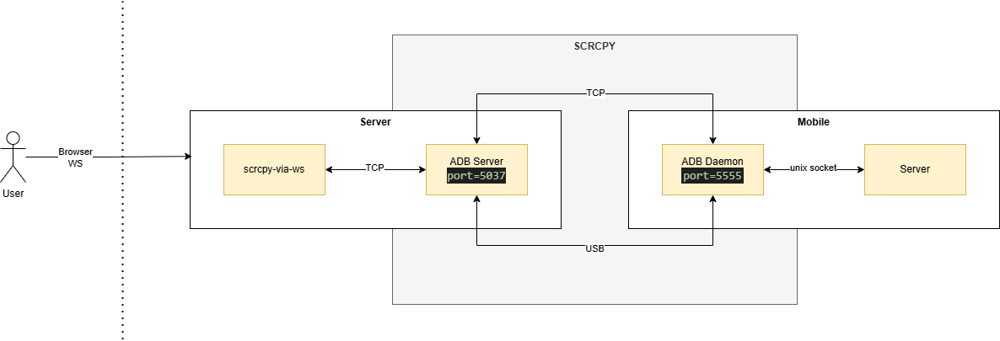

# SCWS stands for ScrCpy via WS
WebSocket streaming based client of [Genymobile/scrcpy](https://github.com/Genymobile/scrcpy) used for:
- streaming video and audio
- remote control (key strokes, mouse clicks, scroll & touch events)
 of Android apps.

 Use cases:
 - Remote control your physical Andorid device (connected either via USB or WIFI)
 - Remote control of [Remote Android](https://github.com/remote-android/redroid-doc) apps, Android running as a docker container in the cloud.
 - Play online Andorid games in your browser 

## Inspired by
This project was inspired by [ws-scrcpy](https://github.com/NetrisTV/ws-scrcpy), which unfortunatelly seems a bit outdated and unmaintained (audio streaming is missing due to old `scrcpy` version; it offers only video streaming)

## Powered by
- [Tango-App's](https://docs.tangoapp.dev) great Readable/Writable-Stream APIs and [adb](https://developer.android.com/tools/adb) client implementation [@yume-chan](https://github.com/yume-chan/ya-webadb).
- [uWebSockets.js](https://github.com/uNetworking/uWebSockets.js) - extermely fast WS-Server, that allows for this low latency video/audio streaming.

# Demo
[ScrCpy via WebSockets Demo](https://scws.roomler.live/)

# Architecture


# Quick start
`docker compose up -d`

# Development
## Prerequisites
- `node v22.5.0+`
- `npm i -g pnpm`

## Start Redroid containers
`docker compose up -d redroid-1 redroid-2 redroid-3`

## Install adb (sdk platform tools)
https://developer.android.com/tools/adb

My current installed version is:
```bash
Android Debug Bridge version 1.0.41
Version 35.0.2-12147458
Installed as /usr/lib/android-sdk/platform-tools/adb
```

## Install scrcpy 2.6.1
```bash
git clone https://github.com/Genymobile/scrcpy.git
git checkout v2.6.1
./install_release.sh
```

## Install dependencies
`pnpm recursive install`

## Start API
1. `cd packages/api`
2. `npx @yume-chan/fetch-scrcpy-server 2.6.1`
3. `pnpm run dev`

API will start on `http://localhost:9001`


## Install & start UI
1. `cd ui`
2. `./patch.sh`
3. Create `packages/ui/.env` file with the following content:
```
VITE_BACKEND_URL=http://localhost:9001
VITE_BACKEND_WS_URL=ws://localhost:9001
```
4. npx vite --force
UI will start on `http://localhost:3000`


